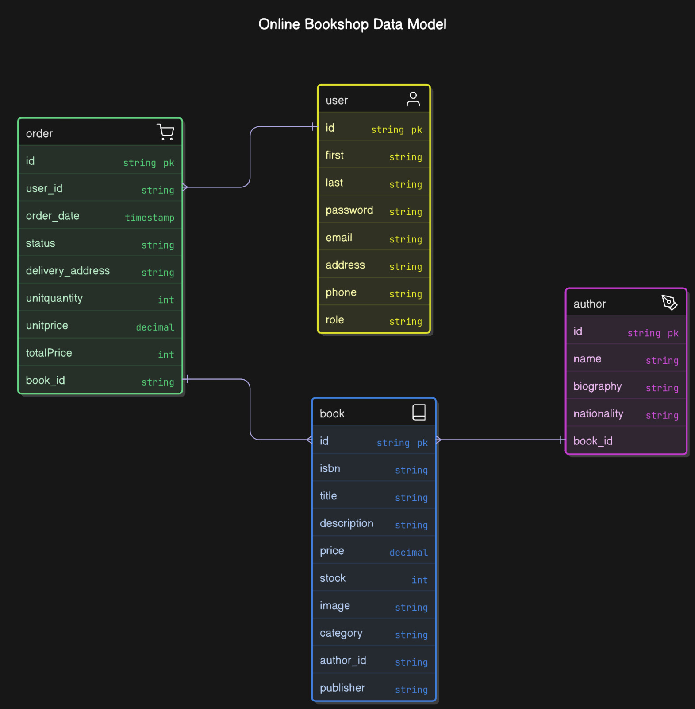

# 📚 Book Shop Project

## 📝 Description

**BookShop-MEN** is a full-stack web application built with **MongoDB**, **Express.js**, and **Node.js**.  
It allows users to browse books, add them to a cart, and place orders. Admins can manage books, authors, users, and orders through a dedicated dashboard.  
This project is a practical demonstration of an online bookstore, featuring authentication, cart, checkout, and admin management.

---

## 🖼️ Screenshots

### Website Images

 

 

 

 

 

 

 

 

 

 

 

 

 

 

 

 

 

 

 

 

 

 

 

 

### ERD Diagram
 

 

### Trello Board
 
">
 

---

## 🚀 Live Demo & Resources

- **Live Demo:** [utopianbookshop.onrender.com](https://utopianbookshop.onrender.com)
- **GitHub Repo:** [Book-Shop-Project](https://github.com/sahmedjaffer/Book-Shop-Project.git)

---

## 🛒 Key Features

- **Browse Books:** Anyone can view all available books and see detailed information.
- **Add to Cart & Checkout:** Users can add books to their cart and proceed to checkout.  
  > 🛑 **Note:** To place an order, users must log in or sign up.  
  > 💳 **Online payment will be available in a future upgrade.**
- **Order Tracking:** Users can view their order history and track order status.
- **Admin Dashboard:** Admins can add, edit, or remove books and authors and confirm orders.
🛑 **Note:** User management will be included in the future upgrade. 

---

## 🧠 Background

- Users can browse and purchase books online.
- Customers manage their accounts and track orders securely.
- Admins efficiently manage authors, books, and orders.

---

## 🛠 Technologies Used

- **Frontend:** HTML, CSS, JavaScript (EJS templating)
- **Backend:** Node.js, Express.js
- **Database:** MongoDB (Mongoose)
- **Authentication:** Auth (express-session)
- **Architecture:** MVC pattern, RESTful APIs

---

## 👥 User Stories

### 👤 User

- Register, log in, and log out securely.
- Update profile (name, email, password, address, phone).
- Browse all books and view details (title, author, price, image).
- Add books to cart and complete checkout.
- View order history and order details.
- Edit or remove items from cart before placing an order.
- **Must log in or sign up to place an order.**

### 👑 Admin

- Manage authors (create, update, delete).
- Manage books (create, update, delete).
- Confirm orders.
- View detailed info for authors, books, and orders.

---

## 🛍️ How to Buy

1. **Browse Books:** View all books without logging in.
2. **Add to Cart:** Add your favorite books to the cart after sign in.
3. **Checkout:**  
   - If not logged in, you’ll be prompted to log in or sign up to proceed.
   - Review your cart, confirm your order, and place it.
4. **Order Tracking:** 
   - Track your orders status in your profile.
5. **Online Payment:**  
   - *Coming soon!* Online payment will be available in a future upgrade.

---

## 🗂️ Project Structure

- **MVC Architecture:** Models, Views (EJS), Controllers.
- **Public Assets:** CSS, JS, and images for a responsive, modern UI.
- **Routes:** RESTful routes for users, books, authors, and orders.

---

## 🖼 Attributions

- Book cover images: from amazon website

---

## 🔮 Future Improvements

- Online payment integration.
- User ratings and reviews for books.
- Advanced search and filtering.
- Mobile-friendly responsive layout.
- Email/SMS notifications for order updates.
- Enhanced analytics for admins.
- Improved UI/UX design.
- Controlling users.
- Controlling Orders.

---

## 👥 Team Members (Group 5: The CSS Crusaders)

- Sayed Ahmed Khadhim  
- Ahmed Isa  
- Hasan Juma

---

📚 **Happy Reading and Shopping!** ✨
